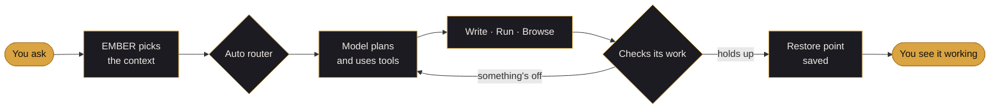

<div align="center">


<br><br>

[](https://pallarium.org)
[](https://pallarium.org)


**[See it work](#see-it-work)** &nbsp;·&nbsp;
**[What's new](#new-in-1596)** &nbsp;·&nbsp;
**[Every model](#one-window-every-model)** &nbsp;·&nbsp;
**[How it thinks](#the-living-systems)** &nbsp;·&nbsp;
**[Everything else](#everything-else)** &nbsp;·&nbsp;
**[Get it](#get-it)** &nbsp;·&nbsp;
**[FAQ](#faq)**

<br>


</div>


## See it work

Most assistants hand you a snippet and wish you luck. **Pallarium builds the thing.**
It writes real files on your disk, opens them in its own preview, plays what it made,
looks at the result, and only *then* tells you it's done.



<p align="center"><sub>One message. It wrote the game, opened it, played it, checked it for errors, graded how it looks,<br>and saved a restore point — before saying a word.</sub></p>

<br>

<table>
<tr>
<td width="50%" valign="top">


### Builds the thing

Describe it in plain English. It writes the files, runs them, and shows you the
result working — not a list of instructions for you to follow.

</td>
<td width="50%" valign="top">


### Checks its own work

It doesn't just say "done." It opens what it built, plays it, reads the console
and grades the result — then fixes whatever didn't hold up.

</td>
</tr>
<tr>
<td width="50%" valign="top">


### Extends itself

Ask for a feature and it adds one to its own interface — a colour lab, a focus
timer, a notepad — live, with no restart and no rebuild.

</td>
<td width="50%" valign="top">


### Uses your browser

It works in your real Chrome — looks things up, fills things in, clicks through —
with your own logged-in sessions, not a sandbox somewhere else.

</td>
</tr>
</table>

**And it remembers.** Your projects, your coding style, the decisions you already made —
it keeps them between sessions, so you're not re-explaining yourself every morning.


## New in 1.5.96

### 🎙️ Voice that knows who is talking

Six people in a room used to be "Guest 1" through "Guest 6". Now say *"I'm Sam"* once and
your name sticks to your messages from then on. Short questions no longer get chopped off
either: a normal thinking pause is a pause, not the end of your sentence.

### 🌐 Browser control that stops dropping out

Chrome no longer loses the agent mid task. One shared debugger session per tab keeps
browser automation, game control and voice steady through long sessions.

### ↺ Rewind — break anything, undo everything



Every time Pallarium changes a project it quietly saves a restore point. Broke something?
Tap the Rewind icon, pick a moment, and the **whole project** goes back — files added since
are cleaned up, and the rewind itself can be undone. It works on any folder, not just git
repos, and the history survives a crash.

### 🎓 Train your own model



Turn on **Settings → Training**, name what you're doing — `websearch`, `file-editing`,
anything — and work as usual. Pallarium records every step it takes into that dataset.
Train a small local model on it and it shows up in your model list like any other.

> **Heads up:** small local models learn the *shape* of your workflow fast, but they need plenty of
> examples before they make good decisions on their own. Leave Training on for a few days
> of real work before you judge the result.


## One window. Every model.



Leave it on **Auto** and Pallarium picks a model for each message based on what you're
asking — or pin the one you want.

| Where | Models |
| :-- | :-- |
| **Cloud** | Claude · GPT · Gemini · Grok · DeepSeek · Mistral · Groq · Cohere · Together · Fireworks · NVIDIA · Cerebras · Perplexity · OpenRouter |
| **Local** | Any Ollama model — private, offline, and free. Install Ollama from inside the app. |
| **Anything else** | Any OpenAI-compatible endpoint |
| **Your own** | Models you trained with Training Data Mode |


## The living systems

Pallarium isn't one prompt wrapped around a model. It's a set of systems that watch,
remember and learn — each with one job.



| System | What it does for you |
| :-- | :-- |
| **COR** · the heart | Keeps everything in rhythm. May follow up when you go quiet — with a hard hourly cap, so it never nags. |
| **ARGUS** · the eyes | When you switch it on, it watches your screen and speaks up when something's worth saying. |
| **VOX** · the voiceprint | Recognizes who's talking. Ask *"who do you know?"* or say *"forget Sam."* |
| **EMBER** · the focus | Hand-picks the context each message actually needs, so replies stay fast and cheap. |
| **VEIN** · the blood | When you ask for it, tries several approaches and keeps the one that works. |
| **SCAR** · the scar tissue | Turns every error into a lesson so the same mistake doesn't happen twice. |
| **WARDEN** · the guard | Catches bad habits — loops, guesses, skipped checks — before you ever see them. |
| **NIMS** · the seeds | Long-term memory that carries from one session to the next. |

### How one message becomes finished work




## Everything else

<table>
<tr>
<td width="33%" valign="top">

**🎙️ Voice**<br>
Talks back in natural neural voices, and listens hands-free.

</td>
<td width="33%" valign="top">

**📱 Phone**<br>
Chat with the same Pallarium — same memory, same tools — from your phone.

</td>
<td width="33%" valign="top">

**⏰ Workers**<br>
Jobs on a schedule: *"check my inbox every two hours."* Act on their own, or draft for you to approve.

</td>
</tr>
<tr>
<td valign="top">

**🤖 Background agents**<br>
Hand off work that runs in parallel, each on whatever model you choose.

</td>
<td valign="top">

**💬 Rooms**<br>
Pallarium can hold a conversation with other AIs on the web, like Gemini.

</td>
<td valign="top">

**🧩 Modules**<br>
Ask for a tool and it adds it to its own interface — live.

</td>
</tr>
<tr>
<td valign="top">

**🛠️ Skills & MCP**<br>
Install skills and MCP servers, or write and test your own in Skill Studio.

</td>
<td valign="top">

**🎨 Never the same twice**<br>
Every build gets a fresh look, sound and name — unless you ask for simple.

</td>
<td valign="top">

**🖼️ Images**<br>
Generates images through several backends, falling back when one is busy.

</td>
</tr>
<tr>
<td valign="top">

**🧊 3D with Blender**<br>
Drives Blender in the background and shows you a live view.

</td>
<td valign="top">

**🐙 GitHub**<br>
Discover, clone and inspect repos without leaving the app.

</td>
<td valign="top">

**🔬 Analyzer**<br>
See tokens, speed and reliability for every model you've used.

</td>
</tr>
<tr>
<td valign="top">

**📋 Plans**<br>
Big jobs get a plan you can edit, skip ahead on, or regenerate.

</td>
<td valign="top">

**🗓️ Agenda**<br>
Keeps track of what's due and brings it up when it matters.

</td>
<td valign="top">

**🌐 Real Chrome**<br>
A companion extension lets it work in the browser you already use.

</td>
</tr>
</table>

<br>

<div align="center">

| 180k+ | 49k | 139 | 15+ | 640+ |
| :--: | :--: | :--: | :--: | :--: |
| lines of Go | lines of interface | built-in tools | model providers | test files |

</div>


## Yours, on your machine

| Promise | What it means |
| :-- | :-- |
| **Your files stay home** | Projects, memory and datasets live on your disk. Pick a local model and your conversations never leave your computer. |
| **No account, no tiers** | Download it and open it. No sign-up, no trial timer, nothing to upgrade. |
| **Your own keys** | Use a key from Anthropic, OpenAI, Google, xAI, OpenRouter and more — or run Ollama and pay nobody. |
| **Nothing recorded unless you say so** | Training Data Mode is off by default, every time. |
| **Free forever** | Not a trial. Not a freemium tier. |


## Get it

<table>
<tr><td>

**Windows 10 & 11** — grab the [Pallarium Launcher](https://pallarium.org) *(7 MB)*, or paste one line into PowerShell:

```powershell
irm https://pallarium.org/install.ps1 | iex
```

</td></tr>
<tr><td>

**Linux**

```bash
curl -fsSL https://pallarium.org/install.sh | sh
```

</td></tr>
</table>

It keeps itself up to date from there. On first launch it runs with **no keys at all** —
install Ollama from inside the app for a free local model, or paste a key for a cloud one.


## FAQ

<details>
<summary><b>Is it really free?</b></summary>
<br>
Yes. No account, no trial, no paid tier. If you use a cloud model you pay that provider for
what you use, directly — or run a local model through Ollama and pay nobody.
</details>

<details>
<summary><b>Does my code leave my computer?</b></summary>
<br>
Your files, memory and datasets stay on your disk. When you chat with a <i>cloud</i> model,
what you send goes to that provider, the same as any other app that uses them. Pick a local
Ollama model and your conversations never leave your machine.
</details>

<details>
<summary><b>Do I need an API key?</b></summary>
<br>
No. Install Ollama from inside the app and you have a working, private model with no key.
Add a key whenever you want a cloud model.
</details>

<details>
<summary><b>Can I undo what it does?</b></summary>
<br>
Yes — that's what Rewind is for. Every change saves a restore point, and rewinding is itself
undoable.
</details>

<details>
<summary><b>Windows warned me when I ran the installer.</b></summary>
<br>
The installer isn't code-signed yet, so SmartScreen may show a warning. Click
<b>More info → Run anyway</b>.
</details>

<details>
<summary><b>What about macOS?</b></summary>
<br>
Not yet. Windows and Linux today.
</details>

<details>
<summary><b>Is it open source?</b></summary>
<br>
No. Pallarium is free to download and use, but the source is not public.
</details>

<br>

---

<div align="center">


### [pallarium.org](https://pallarium.org)

<sub>Pallarium is free to download and use. The source is not public.</sub>

</div>
