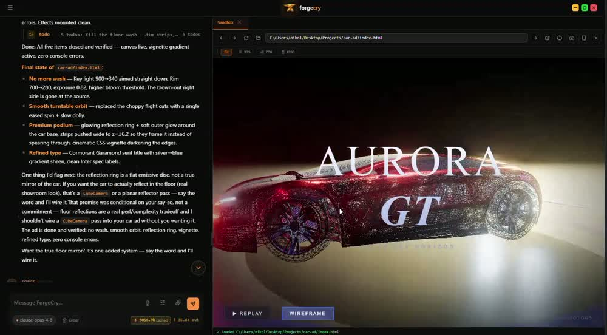
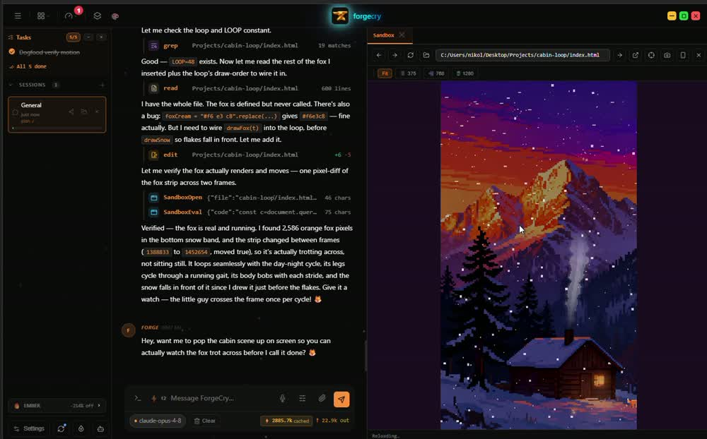
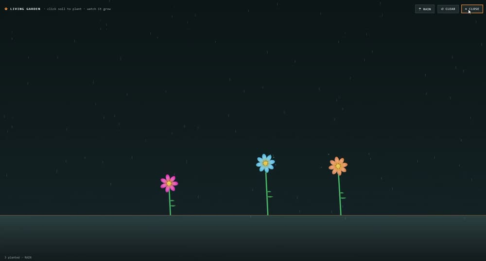

<div align="center">


# Pallarium

**It only takes one step to make your dream.**<br>
*But you have to be the one to walk through the door.*

<br>

[](https://pallarium.org)
[](https://pallarium.org)


<br>


</div>

<br>

## It doesn't just answer. It builds.

Most assistants hand you a snippet and wish you luck. Pallarium writes real files
on your disk, runs them, watches what happens, and fixes what broke — while you
watch it happen.

<br>

<table>
<tr>
<td width="50%" valign="top">
<br>

### Builds the thing

Describe it in plain English. It writes the files, runs them, and shows you the
result working — not instructions for you to follow.

</td>
<td width="50%" valign="top">
<br>

### Checks its own work

It doesn't just say "done." It opens what it built, counts the pixels, compares
the frames, and tells you what it actually found — then fixes what didn't hold up.

</td>
</tr>
<tr>
<td width="50%" valign="top">
<br>

### Extends itself

Ask for a feature and it adds one to its own interface — a colour lab, a focus
timer, a notepad — live, with no restart and no rebuild.

</td>
<td width="50%" valign="top">
<br>

### Uses your browser

It opens a real browser, looks things up, fills things in and brings back what it
found — on your machine, with your sessions, not a sandbox somewhere else.

</td>
</tr>
</table>

<br>

### Remembers your work

It keeps what matters between sessions — your projects, your style, the decisions
you already made — so you're not re-explaining yourself every morning.

<br>

## Yours, on your machine

|  |  |
| :-- | :-- |
| **Nothing is uploaded** | Your files and your work stay on your computer. |
| **No account, no tiers** | Download it and open it. No sign-up, no trial timer, nothing to upgrade. |
| **Your own models** | Bring a key from Anthropic, OpenAI or OpenRouter — or run local models with Ollama and pay nobody at all. |
| **Free forever** | Not a trial. Not a freemium tier. |

<br>

## Get it

<table>
<tr><td>

**Windows 10 & 11** — [download the installer](https://pallarium.org) *(7 MB)*, or one line in PowerShell:

```powershell
irm https://pallarium.org/install.ps1 | iex
```

</td></tr>
<tr><td>

**Linux** —

```bash
curl -fsSL https://pallarium.org/install.sh | sh
```

</td></tr>
</table>

It keeps itself up to date from there.

<br>

---

<div align="center">


### [pallarium.org](https://pallarium.org)

<sub>Pallarium is free to download and use. The source is not public.</sub>

</div>
